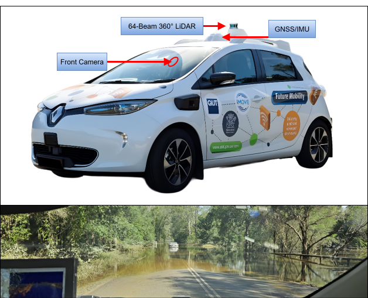

# python-FRED  
[](https://creativecommons.org/licenses/by-nc-sa/4.0/)
[](https://avr3.org.au/)
[](https://pixi.sh)
[](https://github.com/AVR3-Training-Centre/python-FRED/stargazers)
[](./README.md)

<p align="center">
  
</p>  
This repository provides the devkit tools for working with the Flooded Road Environments Dataset (FRED). This autonomous vehicle dataset has been developed to enable research into the detection of flooded roads during on-road deployment. The dataset was collected using a Renault Zoe with custom modifications to enable autonomy, including front and rear Blackfly cameras, an Ouster OS1 LiDAR, and a GNSS-corrected IMU. Data has been collected using the vehicle's sensor stack from 5 separate locations around Brisbane, Australia, both during and after flooding events. Semantic labels are provided for images to enable the development of detection methods, and corresponding position information from the GNSS-corrected IMU has been provided across sequences to additionally enable localization research for these scenarios.

## Links
Dataset: https://huggingface.co/datasets/CMalone-Jupiter/FRED  
Huggingface Space: https://huggingface.co/spaces/CMalone-Jupiter/python-FRED  
Research Group: https://avr3.org.au/ 

## Install
Currently the SDK comes with a pixi.toml file that can be used to set up a python environment using the pixi package manager. In addition, a DockerFile is provided for use in this Huggingface app for online usage of the SDK and dataset. This may be able to be used to create a Docker environment on your own computer, however, this functionality is not tested.

## SDK Tools
This development kit provides several tools including loading, visualisation, and evaluation tools. Currently this includes: 

- Projecting pointclouds onto images
- Visualising semantic labels on images
- Evaluating semantic segmentation predictions
- Displaying corresponding images across sequences from the same locations
- Plotting sequence trajectories
- Evaluating Visual Place Recognition (VPR) performance
- Creating pointcloud semantic labels from image annotations
- Creating range images from pointclouds
- Infilling missing ground points in pointclouds

The SDK will continue to be developed and updated to improve the functionality and utility for the research community.

## Dataset Structure  
We adopt the following structure for FRED to include a KITTI-style format for the dataset and the native recording format using RTmaps.  
```
  ├── flooded                             # Location sequences captured during flooding events
  │   ├── KITTI-style                     # Sequences in a KITTI-style format
  │   |   ├── Cambogan_20250811_113017    # Sequence by location
  │   |   |   ├── back-imgs
  │   |   |   |   └── <timestamp>.png     # Images in 'png' format
  │   |   |   ├── back-labels
  │   |   |   |   └── <timestamp>.png     # Semantic labels in 'png' format
  │   |   |   ├── front-imgs
  │   |   |   |   └── <timestamp>.png     # Images in 'png' format
  │   |   |   ├── front-labels
  │   |   |   |   └── <timestamp>.png     # Semantic labels in 'png' format
  │   |   |   ├── imu
  │   |   |   |   └── <timestamp>.txt     # IMU data formatted as a 'txt' file
  │   |   |   ├── ouster
  │   |   |   |   └── <timestamp>.bin     # Point clouds formatted as a binary file
  │   |   |   └── utm
  │   |   |       └── <timestamp>.txt     # UTM locations formatted as a 'txt' file
  │   |   ├── ...
  │   |   └── ...
  │   └── native-RTmaps                   # Sequences in native recording format
  │       ├── Cambogan_20250811_113017    # Sequence by location
  │       |   ├── Camera_Rec              # Recording files for image playback
  │       |   ├── IMU_Info_Rec            # Recording files for IMU playback
  │       |   └── Ouster_Rec              # Recording files for LiDAR playback
  │       ├── ...
  │       └── ...
  │
  └── dry                             # Location sequences captured while 'dry'
      ├── KITTI-style                     
      └── native-RTmaps              
```  
  
## Data Formats  
### Image Format  
Images are stored in PNG format.  

### Point Cloud Format
Point clouds are stored in binary format (.bin), with each point containing x, y, z positions, as well as reflectivity values. Reflectivity values are surface normalized signal intensity measurements that range from 0 to 255. 3D coordinates are captured in the right-hand coordinate frame with the positive x-axis in the vehicle's direction of travel.  

### UTM Format
UTM data is stored in text file format (.txt), with UTM x and y values being stored as space separated values in the file.  

### IMU Format
Additional IMU information is also stored in text file format (.txt). A space delimiter is again used to separate values. The additional IMU data is stored in the following order:  
```
[ Latitude, Longitude, Altitude,  
Roll, Pitch, Yaw,  
North Velocity, East Velocity,  
x Velocity, y Velocity, z Velocity,
x Angular Velocity, y Angular Velocity, z Angular Velocity,  
x Angular Velocity, y Angular Velocity, z Angular Velocity,  
x Angular Accel, y Angular Accel, z Angular Accel,  
x Angular Accel, y Angular Accel, z Angular Accel,  
Position Accuracy, Velocity Accuracy,  
Navstate Value, Numstat Value,  
Position Mode, Velocity Mode, Orientation Mode ]  
```